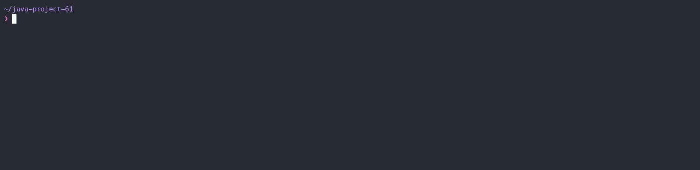

# Игры разума (Java)

[](https://github.com/blackAdmln/java-project-61/actions)
## Showcases
### Greeting


### Even


### Calculator



### GCD


## Start

```bash
make
```

## Setup && run

```bash
make run
```

## Run linter

```bash
make lint_check
```

## Check update dependencies and plugins

```bash
make dep_update
```

<details>
<summary>Автоматические тесты Хекслета</summary>

Тесты запускаются на каждый коммит. За запуск отвечает файл `.github/workflows/hexlet-check.yml` — не удаляйте и не переименовывайте ни его, ни репозиторий.

</details>

